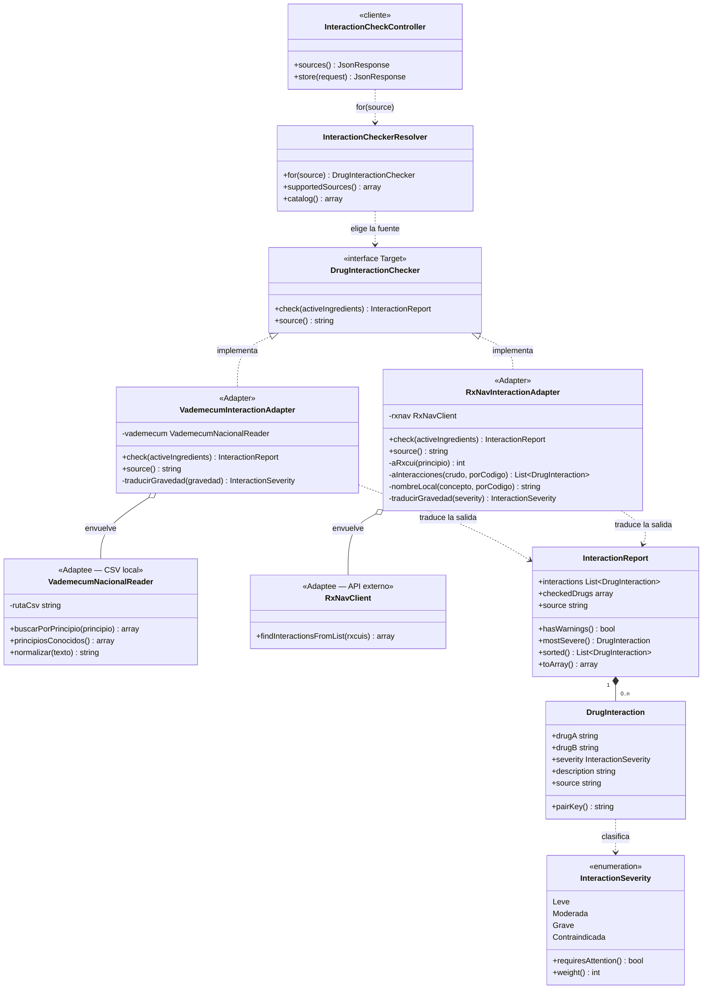

# Patrón Adapter en el código

## ¿Dónde se usa?

En el módulo de **verificación de interacciones medicamentosas**
(`backend/app/Support/Interactions`), que implementa el objetivo específico 3 del
proyecto: alertar al profesional cuando la fórmula que está firmando tiene
combinaciones peligrosas.

Es el primer patrón **estructural** del proyecto: los cinco anteriores son
creacionales y responden a *cómo se crea* un objeto; éste responde a *cómo se
conectan* objetos que ya existen y no se hablan.

| Rol GoF | Archivo |
|---|---|
| **Target** (interfaz que el sistema quiere) | `backend/app/Support/Interactions/Contracts/DrugInteractionChecker.php` |
| **Adapter** 1 | `Adapters/VademecumInteractionAdapter.php` |
| **Adapter** 2 | `Adapters/RxNavInteractionAdapter.php` |
| **Adaptee** 1 (CSV local) | `External/VademecumNacionalReader.php` |
| **Adaptee** 2 (API externo) | `External/RxNavClient.php` |
| Resultado en el vocabulario del sistema | `InteractionReport.php`, `Parts/DrugInteraction.php`, `InteractionSeverity.php` |
| Selección de la fuente en runtime | `InteractionCheckerResolver.php` |
| Quién lo usa | `Api/InteractionCheckController.php`, `Api/ClinicalEncounterController.php` |
| Datos del vademécum | `backend/database/data/vademecum-interacciones.csv` |
| Configuración | `backend/config/interactions.php` |
| Pruebas del patrón | `backend/tests/Unit/DrugInteractionAdapterTest.php`, `backend/tests/Feature/InteractionCheckTest.php` |

## Diagrama UML



Las dos relaciones que definen el patrón son las de **agregación** (rombo
hueco) entre cada adaptador y su adaptee: el adaptador **envuelve** al objeto
ajeno, no hereda de él. Es la variante de *adaptador de objeto*, la recomendada,
porque permite envolver clases `final`, sustituir el adaptee en pruebas y no
arrastrar la interfaz del proveedor.

Nótese también lo que **no** hay en el diagrama: ninguna flecha desde
`InteractionCheckController` hacia `RxNavClient` o `VademecumNacionalReader`. El
cliente sólo conoce la interfaz de la izquierda.

## El núcleo del patrón

Las dos fuentes no se parecen en nada:

| | RxNav (NLM) | Vademécum institucional |
|---|---|---|
| Qué recibe | códigos **RxCUI numéricos** | **un nombre** a la vez |
| Qué devuelve | JSON anidado en inglés | filas planas en español |
| Escala | `high` / `moderate` / `low` | `grave` / `moderada` / `leve` |
| Disponibilidad | depende de la red | archivo local |

El **Target** es la única interfaz que el resto del sistema conoce:

```php
interface DrugInteractionChecker
{
    public function check(array $activeIngredients): InteractionReport;

    public function source(): string;
}
```

El **Adaptee** conserva la firma que decidió su autor. No implementa nada
nuestro — si lo hiciera, el adaptador sobraría:

```php
final class RxNavClient
{
    /** Pide códigos RxCUI numéricos, no nombres. */
    public function findInteractionsFromList(array $rxcuis): array { /* … */ }
}
```

El **Adapter** salva los tres desajustes: argumentos, nombre de la llamada y
formato de la respuesta.

```php
final class RxNavInteractionAdapter implements DrugInteractionChecker
{
    // COMPOSICIÓN, no herencia.
    public function __construct(private readonly RxNavClient $rxnav) {}

    public function check(array $activeIngredients): InteractionReport
    {
        $porCodigo = [];                                    // 1. entrada: nombre → RxCUI

        foreach ($activeIngredients as $principio) {
            $codigo = $this->aRxcui($principio);
            if ($codigo !== null) {
                $porCodigo[$codigo] = $principio;
            }
        }

        if (count($porCodigo) < 2) {
            return InteractionReport::empty($activeIngredients, $this->source());
        }

        $crudo = $this->rxnav->findInteractionsFromList(array_keys($porCodigo));   // 2. su firma

        return new InteractionReport(                        // 3. salida: a nuestro vocabulario
            interactions: $this->aInteracciones($crudo, $porCodigo),
            checkedDrugs: $activeIngredients,
            source: $this->source(),
            checkedAt: Carbon::now(),
        );
    }
}
```

## ¿Para qué se usa?

Para verificar la fórmula de un paciente contra fuentes externas sin atar el
sistema a ninguna. Funciona en dos sitios:

- **Verificador independiente** — `POST /api/interaction-checks`: el profesional
  consulta una combinación cualquiera antes de prescribir.
- **Dentro de la nota de atención** — `POST /api/clinical-encounters` verifica
  automáticamente las prescripciones que acaban de quedar en la historia y
  devuelve la alerta junto con la nota. La nota **sí se guarda**: la alerta
  informa al profesional, no le bloquea la atención.

El vademécum trae 20 interacciones reales de los fármacos que manejan las
plantillas del sistema. Cada verificación queda auditada con
`hce.interaction.checked`, y la nota registra en su auditoría la gravedad máxima
encontrada.

## ¿Por qué tiene que ser Adapter?

1. **El adaptee no es nuestro.** `RxNavClient` tiene la firma que publicó la
   NLM; no se le puede añadir `implements DrugInteractionChecker`. La prueba
   `el_adaptee_no_implementa_el_contrato_del_sistema` verifica esa premisa —que
   es la que justifica el patrón—.
2. **Aísla la dependencia externa.** El nombre `RxNavClient` aparece en un solo
   archivo. Cambiar de proveedor es escribir otro adaptador y una línea en el
   resolver.
3. **Permite probar sin red.** Las pruebas sustituyen la fuente y corren sin
   salir a internet; la fuente por defecto es local a propósito.
4. **Contiene el fallo del tercero.** Si el servicio se cae, el adaptador
   devuelve un informe vacío en lugar de propagar la excepción.
5. **Usa composición, no herencia.** Es el *adaptador de objeto*: permite
   envolver clases `final` y no arrastra la interfaz del proveedor. La prueba
   `el_adaptador_usa_composicion_y_no_herencia` lo verifica.

El adaptador **no añade funcionalidad, sólo traduce**. Ésa es la diferencia con
los otros estructurales que se le parecen:

| Patrón | Qué hace con la interfaz |
|---|---|
| **Adapter** | La **cambia** — misma funcionalidad, otra forma |
| **Decorator** | La **mantiene** — añade comportamiento encima |
| **Facade** | La **simplifica** — una puerta sencilla a un subsistema complejo |

## Relación con los otros cinco patrones

| | Singleton | Factory Method | Abstract Factory | Builder | Prototype | Adapter |
|---|---|---|---|---|---|---|
| Familia | Creacional | Creacional | Creacional | Creacional | Creacional | **Estructural** |
| Qué resuelve | Unicidad global | Diferir **una** clase | Coherencia de **una familia** | Construir un objeto complejo | **Copiar** uno configurado | **Conectar** interfaces incompatibles |
| Dato que decide | — | `device_type` | `standard` | `encounter_type` | `template` | `source` |
| Cómo se obtiene | `AuditLogger::getInstance()` | `$resolver->for($deviceType)` | `$resolver->for($standard)` | `$director->construct(…)` | `$registry->get($key)` | `$resolver->for($source)` |

Es el único módulo que se comunica con **código que no es nuestro**, y por eso el
único que necesita traductores. Los cinco creacionales trabajan con objetos que
el proyecto diseñó de principio a fin.

## Endpoints

| Método | Ruta | Descripción |
|---|---|---|
| `GET` | `/api/interaction-sources` | Fuentes disponibles y si requieren red |
| `POST` | `/api/interaction-checks` | Verifica una lista de principios activos |

```http
POST /api/interaction-checks
{
  "drugs": ["Losartán", "Espironolactona", "Ibuprofeno"]
}
```

Respuesta (`200`):

```json
{
  "data": {
    "source": "vademecum_nacional",
    "has_warnings": true,
    "total": 2,
    "most_severe": "grave",
    "interactions": [
      {
        "drug_a": "Losartán",
        "drug_b": "Espironolactona",
        "severity": "grave",
        "severity_label": "Grave",
        "requires_attention": true,
        "description": "Riesgo de hiperpotasemia grave por doble bloqueo del sistema renina-angiotensina-aldosterona. Control estrecho de potasio sérico.",
        "source": "vademecum_nacional"
      },
      {
        "drug_a": "Losartán",
        "drug_b": "Ibuprofeno",
        "severity": "moderada",
        "severity_label": "Moderada",
        "requires_attention": true,
        "description": "Los AINE reducen el efecto antihipertensivo del losartán y aumentan el riesgo de deterioro de la función renal. Vigilar presión arterial y creatinina.",
        "source": "vademecum_nacional"
      }
    ]
  }
}
```

Para consultar la fuente externa se añade `"source": "rxnav"`. El cuerpo de la
petición y el de la respuesta son idénticos: ésa es exactamente la ventaja del
patrón.

## Pruebas

```bash
cd backend && php artisan test --filter="DrugInteractionAdapterTest|InteractionCheckTest"
```

Cubren que el adaptee no implementa el contrato del sistema, que el adaptador usa
composición y no herencia, que los nombres se traducen a códigos RxCUI y la
respuesta en inglés al vocabulario propio, que el vademécum descarta las filas
de fármacos ajenos a la fórmula y no repite pares, que tolera tildes y
mayúsculas, que **las dos fuentes son intercambiables para el mismo cliente**,
que la caída del servicio externo no devuelve error al profesional, y que la nota
de atención verifica su propia fórmula.
