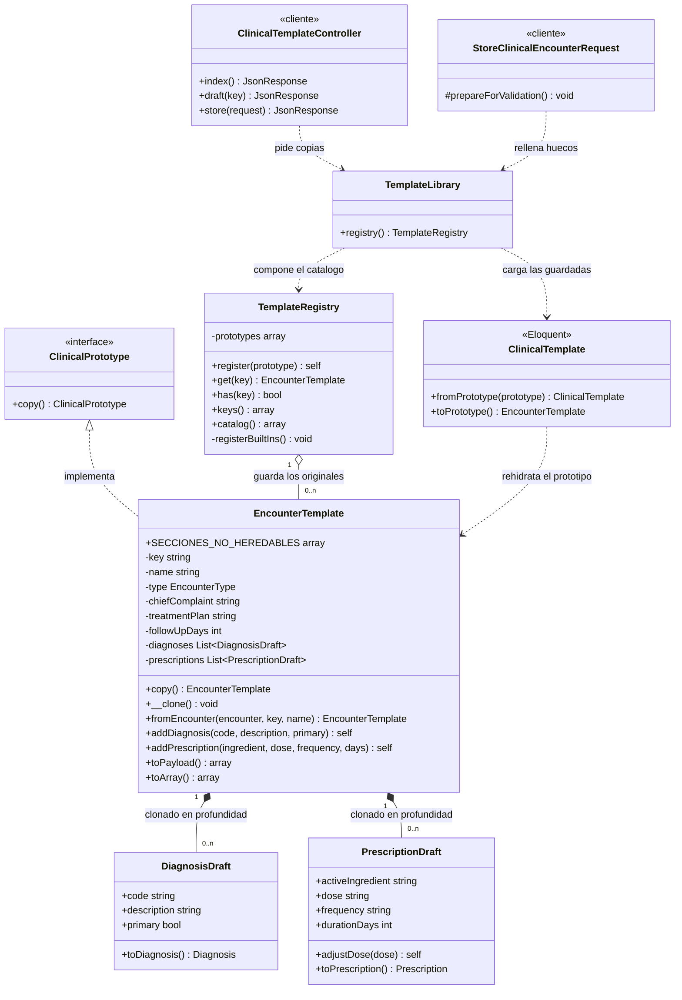

# Patrón Prototype en el código

## ¿Dónde se usa?

En el módulo de **plantillas de atención clínica**
(`backend/app/Support/Templates`), que permite al profesional arrancar una nota
desde una estructura ya configurada en lugar de desde una página en blanco.

| Rol GoF | Archivo |
|---|---|
| **Prototipo** (interfaz) | `backend/app/Support/Templates/ClinicalPrototype.php` |
| **Prototipo concreto** | `backend/app/Support/Templates/EncounterTemplate.php` |
| **Registro de prototipos** | `backend/app/Support/Templates/TemplateRegistry.php` |
| Partes mutables que obligan a la copia profunda | `Parts/DiagnosisDraft.php`, `Parts/PrescriptionDraft.php` |
| Composición del catálogo (código + base de datos) | `backend/app/Support/Templates/TemplateLibrary.php` |
| Quién lo usa | `backend/app/Http/Controllers/Api/ClinicalTemplateController.php`, `backend/app/Http/Requests/StoreClinicalEncounterRequest.php` |
| Persistencia | `backend/app/Models/ClinicalTemplate.php` + migración `create_clinical_templates_table` |
| Pruebas del patrón | `backend/tests/Unit/EncounterTemplatePrototypeTest.php`, `backend/tests/Feature/ClinicalTemplateTest.php` |

## Diagrama UML



`SECCIONES_NO_HEREDABLES` es una constante de clase: la lista de secciones que
`fromEncounter()` descarta al clonar una nota real.

Las dos relaciones de **composición** (rombo lleno) son las que importan:
`DiagnosisDraft` y `PrescriptionDraft` pertenecen a la plantilla y mueren con
ella, por eso `__clone()` tiene que duplicarlas. La relación con
`TemplateRegistry` es en cambio una **agregación** (rombo hueco): el registro
guarda los prototipos pero no los posee en exclusiva —de hecho reparte copias—.

## El núcleo del patrón

`copy()` es la operación del patrón; `__clone()` es donde se decide qué
significa copiar.

```php
final class EncounterTemplate implements ClinicalPrototype
{
    /** @var list<DiagnosisDraft> */
    private array $diagnoses = [];

    /** @var list<PrescriptionDraft> */
    private array $prescriptions = [];

    public function copy(): static
    {
        return clone $this;
    }

    /**
     * Sin este método PHP haría una copia SUPERFICIAL: los arreglos de la copia
     * apuntarían a los mismos objetos que el original.
     */
    public function __clone(): void
    {
        $this->diagnoses = array_map(
            fn (DiagnosisDraft $d) => clone $d,
            $this->diagnoses,
        );

        $this->prescriptions = array_map(
            fn (PrescriptionDraft $p) => clone $p,
            $this->prescriptions,
        );
    }
}
```

El registro guarda instancias configuradas y entrega copias, nunca el original:

```php
public function get(string $key): EncounterTemplate
{
    $prototype = $this->prototypes[$key] ?? null;

    if ($prototype === null) {
        throw ValidationException::withMessages([
            'template' => "La plantilla «{$key}» no existe.",
        ]);
    }

    return $prototype->copy();
}
```

Y al crear una plantilla desde una nota real, la despersonalización es explícita:

```php
/** Secciones que NUNCA se heredan: son el relato de un paciente concreto. */
public const SECCIONES_NO_HEREDABLES = [
    'present_illness', 'history', 'physical_exam', 'vital_signs',
    'patient_id', 'professional_license', 'attended_at', 'triage',
];
```

## ¿Para qué se usa?

Para que el médico parta de una plantilla en vez de rehacer los quince pasos del
Builder en cada consulta, sin degradar la calidad ni la privacidad del registro.

| Clave | Plantilla | Tipo | Diagnóstico |
|---|---|---|---|
| `hta_control` | Control de hipertensión arterial | Control ambulatorio | I10 |
| `dm2_control` | Control de diabetes mellitus tipo 2 | Control ambulatorio | E11.9 |
| `crisis_hipertensiva` | Urgencia hipertensiva | Urgencias | I16.0 |
| `tele_ira` | Teleorientación por infección respiratoria | Teleconsulta | J06.9 |

Además, cualquier profesional puede guardar una nota suya como plantilla: se
clona la estructura y se descarta el relato del paciente. Todo queda auditado con
`hce.template.applied` y `hce.template.saved`.

## ¿Por qué tiene que ser Prototype?

1. **El objeto ya existe configurado.** Una fábrica construye desde cero a partir
   de un tipo; aquí no hay nada que decidir, sólo algo que copiar.
2. **Evita una subclase por plantilla.** Sin el patrón harían falta
   `ControlHipertensionFactory`, `ControlDiabetesFactory`… Con él, dar de alta
   una plantilla es registrar un objeto — por eso el médico puede crear las suyas
   desde la interfaz, imposible si cada plantilla fuera una clase.
3. **Obliga a declarar qué significa copiar.** Copia superficial → dos pacientes
   comparten la misma prescripción. Copia profunda sin filtro → la plantilla
   arrastra la historia del paciente anterior (*copy-forward*). La respuesta
   correcta es copia profunda de la estructura y descarte del relato.
4. **No debilita al Builder.** La copia sólo rellena huecos; el Builder sigue
   cerrando la nota. Una urgencia cargada desde plantilla se rechaza igual si le
   falta el triaje.

## Relación con los otros cuatro patrones

Los cinco conviven en el mismo recorrido del dato (ver [SINGLETON.md](SINGLETON.md),
[FACTORY_METHOD.md](FACTORY_METHOD.md), [ABSTRACT_FACTORY.md](ABSTRACT_FACTORY.md)
y [BUILDER.md](BUILDER.md)):

| | Singleton | Factory Method | Abstract Factory | Builder | Prototype |
|---|---|---|---|---|---|
| Qué resuelve | Unicidad y orden global | Diferir la elección de **una** clase | Coherencia de **una familia** | Construir **un objeto complejo** | **Copiar** uno ya configurado |
| Cuántos objetos | Uno por proceso | Uno por lectura | Tres por exportación | Uno por atención | Uno por copia |
| Dato que decide | — | `device_type` | `standard` | `encounter_type` | `template` |
| Cómo se obtiene | `AuditLogger::getInstance()` | `$resolver->for($deviceType)` | `$resolver->for($standard)` | `$director->construct(...)` | `$registry->get($key)` |

Recorrido completo de una consulta: el **Prototype** entrega la plantilla
copiada, el **Factory Method** aporta las lecturas del dispositivo ya
normalizadas, el **Builder** cierra la nota validando el contenido mínimo, el
**Abstract Factory** la publica en el estándar que pida el receptor y el
**Singleton** deja trazado cada paso.

## Endpoints

| Método | Ruta | Descripción |
|---|---|---|
| `GET` | `/api/encounter-templates` | Catálogo: institucionales y propias |
| `GET` | `/api/encounter-templates/{key}/draft` | Copia del prototipo, lista para el formulario |
| `POST` | `/api/encounter-templates` | Guarda una nota existente como plantilla |

El campo `template` de `POST /api/clinical-encounters` es **opcional**: sin él,
el flujo del Builder es exactamente el mismo de siempre.

```http
POST /api/clinical-encounters
{
  "template": "hta_control",
  "patient_id": 10,
  "professional_license": "RM-12345",
  "present_illness": "Paciente asintomática, adherente al tratamiento.",
  "history": "Hipertensa desde 2019, sin otras comorbilidades."
}
```

La copia aporta el motivo de consulta, el diagnóstico I10, el plan de manejo, el
losartán y la próxima cita a 90 días; el profesional sólo escribe lo que es de
este paciente.

## Pruebas

```bash
cd backend && php artisan test --filter="EncounterTemplatePrototypeTest|ClinicalTemplateTest"
```

Cubren que la copia es un objeto distinto con el mismo contenido, que ajustar la
dosis o el diagnóstico de la copia no toca el original, que las partes de la copia
son objetos independientes, que el registro nunca entrega el prototipo original,
que el borrador no trae datos de ningún paciente, que lo que envía el profesional
gana sobre la plantilla, que usar una plantilla no contamina la siguiente, que la
plantilla guardada no arrastra la historia del paciente que la originó, y que el
Builder sigue exigiendo lo suyo aunque la nota venga de una plantilla.
