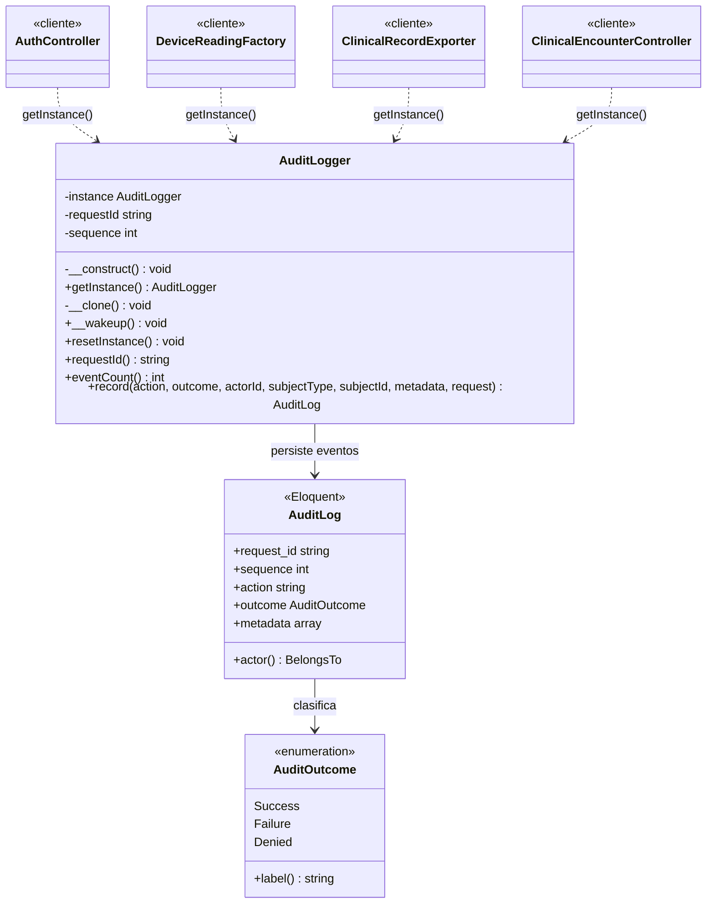
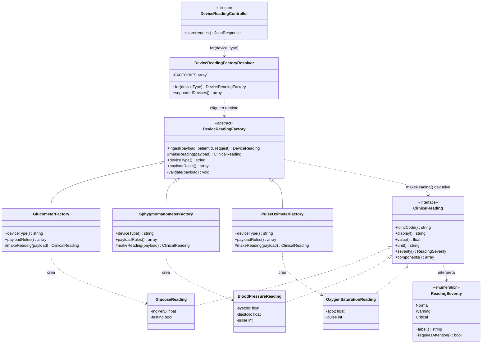
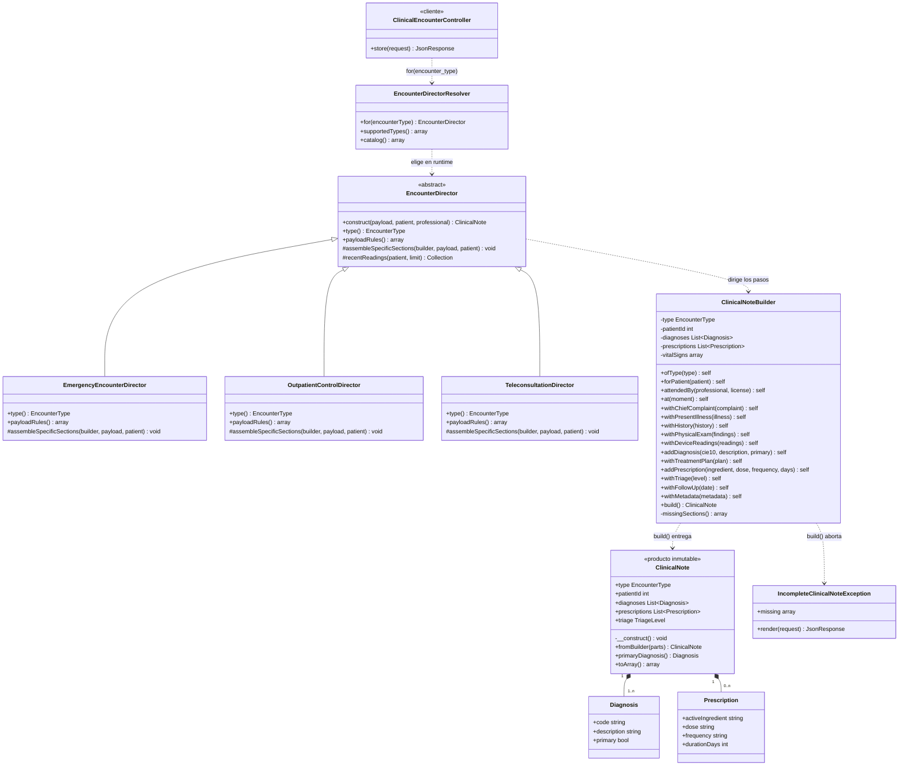
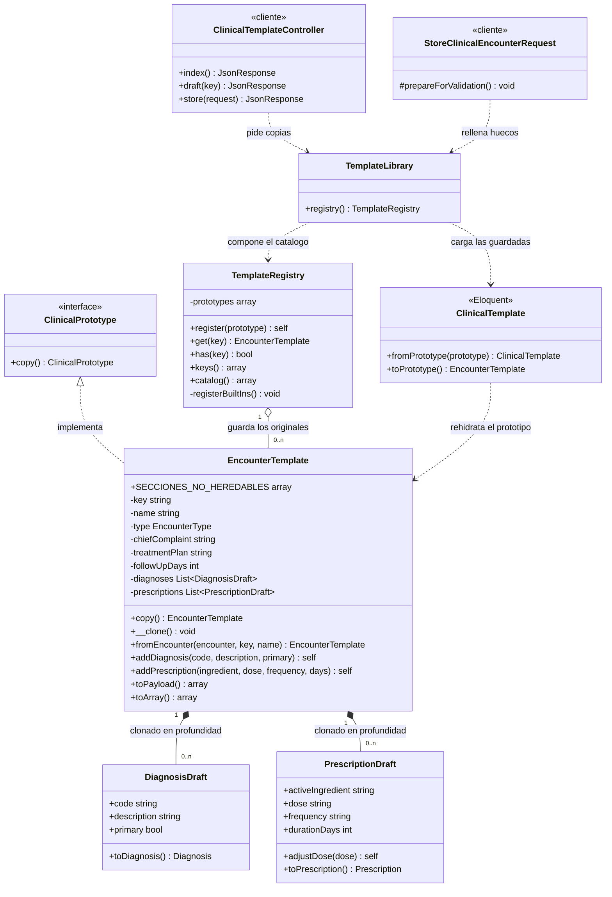
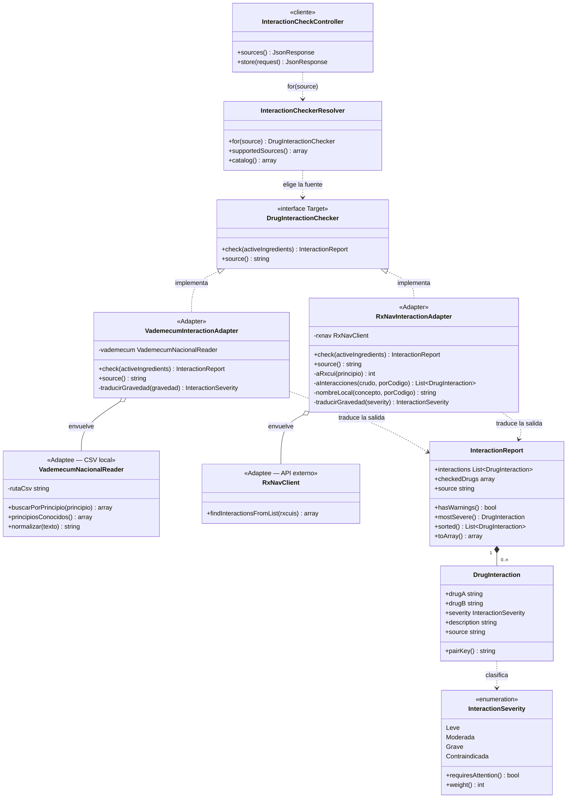
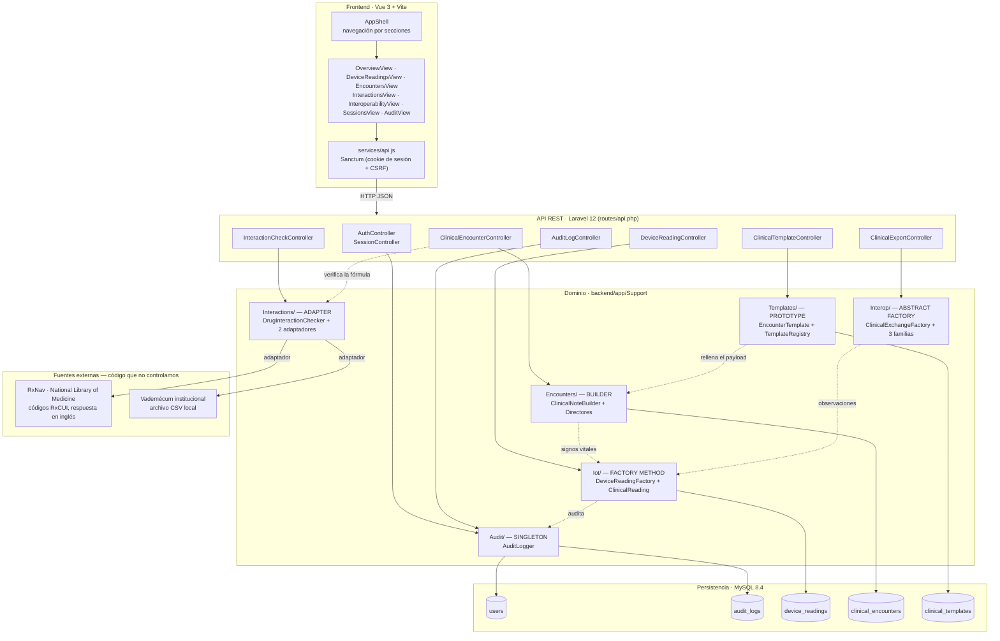
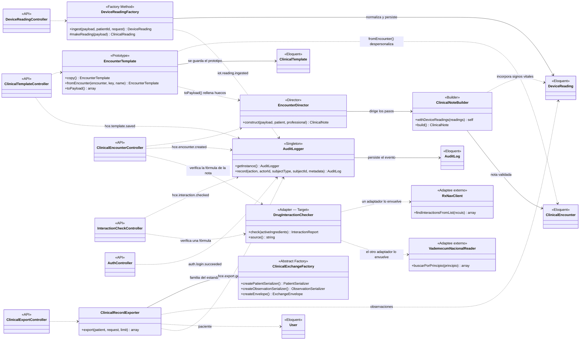

<div align="center">

# Sistema de Historias Clínicas Electrónicas

# Sistema Historias Clínicas Electronicas 🫆
Proyecto para la gestión de pacientes, citas, diagnósticos y tratamientos.
Integración con dispositivos IoT
Alerta de interacciones medicamentosas
Cumplimiento de normativas HIPAA/leyes de protección de datos

# Contextualización
## 1. Panorama del problema
 
El sector salud ha operado durante décadas con expedientes clínicos fragmentados: registros en papel, sistemas aislados por institución (islas de información) y procesos manuales para agendamiento, facturación y seguimiento de tratamientos. Esto genera consecuencias graves:
 
- **Errores médicos evitables**: la OMS estima que los eventos adversos por medicamentos (incluyendo interacciones farmacológicas no detectadas) son una de las diez principales causas de daño al paciente en el mundo.
- **Duplicidad de exámenes** y sobrecostos al sistema porque un prestador no accede al historial de otro.
- **Pérdida de continuidad asistencial** cuando el paciente se traslada de ciudad, cambia de EPS o requiere atención de urgencia lejos de su médico habitual.
- **Baja trazabilidad** en la adherencia a tratamientos crónicos (hipertensión, diabetes), donde el seguimiento con dispositivos IoT podría anticipar descompensaciones.
- **Riesgos de privacidad**: los datos de salud son de categoría especial y su filtración expone a los pacientes y a las instituciones a sanciones y demandas.
## 2. Marco normativo aplicable
 
### En Colombia
 
- **Ley 2015 de 2020**: crea la Historia Clínica Electrónica Interoperable (HCEI) y garantiza el acceso del paciente a su información respetando el Hábeas Data.
- **Resolución 866 de 2021** (MinSalud): reglamenta el conjunto de elementos de datos clínicos relevantes para la interoperabilidad.
- **Resolución 1888 de 2025**: adopta el Resumen Digital de Atención en Salud (RDA) como mecanismo para implementar la Interoperabilidad de la HCE a nivel nacional.
- **Resolución 1995 de 1999**: define contenidos mínimos, diligenciamiento, conservación y custodia de la historia clínica (sigue vigente).
- **Ley 1581 de 2012 y Decreto 1377 de 2013**: régimen general de protección de datos personales, con tratamiento reforzado para datos sensibles (salud).
- **Resolución 3100 de 2019**: habilitación de prestadores de servicios de salud.
### Estándares internacionales de referencia
 
- **HL7 FHIR** — estándar exigido de facto para interoperabilidad clínica; en Colombia la Resolución 866 requiere que los sistemas lo soporten junto con el conjunto mínimo de datos.
- **HIPAA** (EE.UU.) — referente global de privacidad y seguridad; útil como benchmark aunque no aplique legalmente en Colombia.
- **ISO 27799** — seguridad de la información en salud.
- **SNOMED CT, LOINC, CIE-10** — vocabularios clínicos controlados.
## 3. Justificación del proyecto
 
Un sistema de HCE moderno debe responder simultáneamente a tres presiones:
 
1. **Regulatoria**: la HCEI dejó de ser opcional en Colombia; los prestadores que no se alineen enfrentan riesgos de habilitación y acreditación.
2. **Clínica**: reducir errores mediante soporte a la decisión (alertas de interacciones medicamentosas, alergias, dosis) y aprovechar señales de dispositivos IoT (glucómetros, tensiómetros, oxímetros, wearables) para monitoreo remoto y alertas tempranas.
3. **Operacional**: unificar gestión de pacientes, agendamiento, diagnósticos, tratamientos y facturación en una sola plataforma con trazabilidad de auditoría.

# Objetivos

## Objetivo general

Desarrollar un Sistema de Historias Clínicas Electrónicas que centralice la gestión de pacientes, citas, diagnósticos y tratamientos, integrando el monitoreo remoto con dispositivos IoT y el soporte a la decisión clínica, bajo los estándares de interoperabilidad (HL7 FHIR) y las exigencias de protección de datos sensibles establecidas por la normativa colombiana (Ley 2015 de 2020, Ley 1581 de 2012) y referentes internacionales como HIPAA e ISO 27799.

## Objetivos específicos

1. **Unificar el expediente clínico y su trazabilidad.** Implementar los módulos de gestión de pacientes, agendamiento, diagnósticos y tratamientos sobre un registro único, con auditoría centralizada de todos los accesos y modificaciones a la historia clínica, conforme a la Resolución 1995 de 1999 y la HCEI.

2. **Integrar la ingesta normalizada de dispositivos IoT.** Construir un módulo capaz de recibir lecturas de equipos heterogéneos (glucómetros, tensiómetros, oxímetros) y convertirlas en observaciones clínicas estandarizadas con código LOINC, valor, unidad y severidad, exportables a HL7 FHIR según la Resolución 866 de 2021, de forma extensible a nuevos dispositivos sin modificar el código existente.

3. **Incorporar soporte a la decisión y control de acceso.** Desarrollar un motor de alertas de interacciones medicamentosas y fármaco-alergia, junto con la autenticación y autorización por rol (médico, enfermero, administrativo), para reducir eventos adversos evitables y garantizar el tratamiento reforzado que exige el manejo de datos sensibles de salud.

## Patrón de Diseño: Singleton

### ¿Por qué Singleton en este proyecto?

En un Sistema de Historias Clínicas Electrónicas hay componentes que *deben existir en una única instancia* dentro de la aplicación, porque múltiples instancias generarían inconsistencias, condiciones de carrera o violaciones de las normativas de auditoría y seguridad (Res. 1995/1999, Ley 1581/2012, ISO 27799).

### Casos de uso concretos

*1. Conexión a la base de datos clínica*
Un único punto de acceso a la base de datos evita conexiones duplicadas descontroladas, centraliza el pool de conexiones y facilita el control transaccional cuando se registran diagnósticos, tratamientos o eventos IoT en tiempo real.

*2. Gestor de auditoría / logging clínico*
La trazabilidad exigida por la HCEI (Ley 2015 de 2020) requiere que *todos* los accesos y modificaciones a una historia clínica queden registrados de forma centralizada y cronológicamente consistente. Si existieran múltiples instancias del logger, se podrían perder o desordenar eventos críticos para una auditoría.

*3. Motor de reglas de interacciones medicamentosas*
El componente que valida interacciones fármaco-fármaco o fármaco-alergia debe cargar una única vez el catálogo de reglas (basado en vocabularios como SNOMED CT o bases de interacciones) y mantenerlo en memoria. Instanciarlo múltiples veces desperdiciaría recursos y podría generar respuestas inconsistentes ante la misma consulta.

*4. Gestor de configuración global*
Parámetros como las credenciales de integración con dispositivos IoT, endpoints de FHIR, o llaves de cifrado para datos sensibles deben leerse de un solo lugar consistente, evitando que distintos módulos trabajen con configuraciones desincronizadas.

*5. Gestor de sesión/autenticación*
Para cumplir con el control de acceso exigido por la protección de datos sensibles de salud, conviene centralizar la validación de sesiones activas y permisos por rol (médico, enfermero, administrativo) en un único componente.

### Semana 3 - PATRON DE DISEÑO SINGLETON

## Link de video explicativo: https://drive.google.com/file/d/15UcTiR7eaimJ0NZa0y0N0Fs_M6TaDz42/view?usp=sharing

## Diagrama UML



`instance`, `getInstance()` y `resetInstance()` son **estáticos**. Las tres
puertas de entrada están cerradas a propósito: `__construct()` y `__clone()` son
privados y `__wakeup()` lanza excepción, de modo que no hay forma de obtener una
segunda instancia ni por `new`, ni por `clone`, ni deserializando.

Nótese que ningún cliente recibe el logger por inyección: todos lo piden con
`getInstance()`, que es justo lo que garantiza que `requestId` y `sequence` sean
los mismos para toda la petición.

## ¿ Donde de usa ?

> **Implementación:** el patron singleton está implementado en la clase `AuditLogger`
> (`backend/app/Support/Audit/AuditLogger.php`) y se usa desde `AuthController`.

Extracto de `backend/app/Support/Audit/AuditLogger.php`:

```php
final class AuditLogger
{
    /** Única instancia viva del logger en el proceso. */
    private static ?self $instance = null;

    /** Correlativo compartido por todos los eventos de una misma petición. */
    private readonly string $requestId;

    /** Orden monotónico de los eventos; sólo tiene sentido si la instancia es única. */
    private int $sequence = 0;

    /** Privado: nadie fuera de la clase puede hacer `new AuditLogger()`. */
    private function __construct()
    {
        $this->requestId = (string) Str::uuid();
    }

    /** Único punto de acceso a la instancia. */
    public static function getInstance(): self
    {
        return self::$instance ??= new self;
    }

    /** Bloquea la clonación: `clone $logger` crearía una segunda instancia. */
    private function __clone(): void {}

    /** Bloquea la deserialización, la otra vía para duplicar la instancia. */
    public function __wakeup(): void
    {
        throw new \LogicException('AuditLogger es un Singleton y no puede deserializarse.');
    }
}
```

Y así lo consume `AuthController`, sin instanciarlo ni recibirlo por inyección:

```php
$audit = AuditLogger::getInstance();

$audit->record(
    action: 'auth.login.succeeded',
    actorId: $user->id,
    subjectType: User::class,
    subjectId: $user->id,
    request: $request,
);
```

## ¿Para qué se usa?

Para que *todos* los accesos y cambios sobre una historia clínica se registren a
través de un único componente. Hoy audita el flujo de autenticación
(`auth.login.succeeded`, `auth.login.failed`, `auth.logout`, `auth.session.read`)
y guarda cada evento en la tabla `audit_logs`.

## ¿Por qué tiene que ser Singleton?

Porque el logger mantiene dos datos que sólo son correctos si existe una sola
instancia en toda la petición:

- `requestId`: identificador que agrupa todos los eventos de una misma atención.
- `sequence`: contador que da el orden cronológico de esos eventos.
## Pruebas del patrón Singleton

```bash
cd backend
php artisan test --filter="AuditLoggerSingletonTest|AuthAuditTest"
```

**`tests/Unit/AuditLoggerSingletonTest.php`** — la mecánica del patrón

| Prueba | Qué garantiza |
|---|---|
| Devuelve siempre la misma instancia | `getInstance()` nunca crea una segunda instancia |
| El constructor es privado | No se puede esquivar el patrón con `new AuditLogger()` |
| No puede clonarse | `clone` está bloqueado: sería la segunda vía de duplicación |
| No puede deserializarse | `__wakeup()` lanza excepción: la tercera vía, también cerrada |
| El contenedor resuelve la misma instancia que `getInstance` | Ni siquiera la inyección de dependencias de Laravel rompe la unicidad |
| Comparte `requestId` y secuencia entre llamadas desacopladas | Dos módulos que no se conocen escriben en el mismo correlativo |

**`tests/Feature/AuthAuditTest.php`** — el patrón en uso real

| Prueba | Qué garantiza |
|---|---|
| Un login exitoso queda auditado | El evento llega a `audit_logs` con su actor |
| Un login fallido queda auditado sin la contraseña | Se traza el intento sin filtrar credenciales |
| El logout cierra la sesión y queda auditado | El cierre también deja rastro |

**Resultado**

```
Tests:    9 passed (28 assertions)
```

---

## Patrón de Diseño: Factory Method

### ¿Por qué Factory Method en este proyecto?

El módulo de **monitoreo remoto con dispositivos IoT** recibe lecturas de equipos
heterogéneos —glucómetros, tensiómetros, oxímetros— cada uno con su propio
formato, sus propias unidades y sus propios rangos de alarma. El sistema, en
cambio, necesita almacenar y exportar siempre lo mismo: una observación clínica
normalizada con su código LOINC, su valor, su unidad y su criticidad, como exige
la Resolución 866 de 2021 para la interoperabilidad de la HCE.

El tipo de dispositivo llega dentro del JSON de la petición, es decir, **sólo se
conoce en tiempo de ejecución**, de modo que la creación del objeto no puede
fijarse con un `new` en el código. Ése es exactamente el problema que resuelve el
Factory Method: una clase creadora define el flujo de ingesta y delega en sus
subclases la decisión de qué producto concreto instanciar.

### Casos de uso concretos

*1. Normalización de lecturas de dispositivos IoT (implementado)*
Cada fábrica traduce el payload de su equipo al producto `ClinicalReading`, con
su código LOINC y su interpretación clínica. Dar de alta un termómetro o una
báscula es añadir una subclase, sin tocar el controlador ni la base de datos.

*2. Exportación de la historia clínica*
Un `ClinicalExportFactory` con variantes FHIR, PDF y RDA (Res. 1888 de 2025)
resuelve el formato de salida según lo que pida el prestador receptor.

*3. Notificación de alertas críticas*
El canal por el que se avisa una hipoxemia o una crisis hipertensiva (SMS, push,
correo, integración con el sistema de urgencias) depende de la configuración de
la institución y del turno, otro dato conocido sólo en runtime.

### Semana 4 - PATRON DE DISEÑO FACTORY METHOD

## Link de video explicativo: https://drive.google.com/file/d/1lFiXxtjQ45YPVZPrdQzlTTKG5lYu10HB/view?usp=sharing

## Diagrama UML



La línea punteada de `DeviceReadingFactory` a `ClinicalReading` es la clave: el
creador depende de la **abstracción** del producto, nunca de las clases
concretas. Quien decide cuál instanciar es cada subclase en `makeReading()`, el
método fábrica.

`ingest()` es `final` y `makeReading()` es abstracto: el flujo lo fija la
superclase, la elección del producto la delega.

## ¿ Donde de usa ?

> **Implementación:** el patron factory method está implementado en la clase
> `DeviceReadingFactory` (`backend/app/Support/Iot/DeviceReadingFactory.php`),
> sus tres subclases (`GlucometerFactory`, `SphygmomanometerFactory`,
> `PulseOximeterFactory`) y el producto `ClinicalReading`
> (`backend/app/Support/Iot/Readings/ClinicalReading.php`). Se usa desde
> `DeviceReadingController`.

Extracto de `backend/app/Support/Iot/DeviceReadingFactory.php`:

```php
abstract class DeviceReadingFactory
{
    /** EL MÉTODO FÁBRICA: la superclase sabe *que* necesita una lectura, pero no *cuál*. */
    abstract protected function makeReading(array $payload): ClinicalReading;

    /** Identificador del dispositivo tal como llega en la petición. */
    abstract public function deviceType(): string;

    /** Reglas de validación del payload crudo, propias de cada dispositivo. */
    abstract public function payloadRules(): array;

    /** Plantilla del flujo: idéntica para todos los dispositivos, por eso es `final`. */
    final public function ingest(array $payload, ?int $patientId = null, ?Request $request = null): DeviceReading
    {
        $this->validate($payload);

        $reading = $this->makeReading($payload);   // ← delegación a la subclase

        $record = DeviceReading::create([
            'device_type' => $this->deviceType(),
            'loinc_code'  => $reading->loincCode(),
            'value'       => $reading->value(),
            'unit'        => $reading->unit(),
            'severity'    => $reading->severity(),
            'components'  => $reading->components(),
            'patient_id'  => $patientId,
        ]);

        // Reutiliza el Singleton de auditoría: la lectura entra en la historia clínica.
        AuditLogger::getInstance()->record(
            action: 'iot.reading.ingested',
            subjectType: DeviceReading::class,
            subjectId: $record->id,
            metadata: ['device_type' => $this->deviceType(), 'severity' => $reading->severity()->value],
            request: $request,
        );

        return $record;
    }
}
```

Cada creador concreto implementa sólo lo que le distingue:

```php
final class GlucometerFactory extends DeviceReadingFactory
{
    public function deviceType(): string { return 'glucometer'; }

    public function payloadRules(): array
    {
        return [
            'mg_dl'   => ['required', 'numeric', 'between:10,900'],
            'fasting' => ['sometimes', 'boolean'],
        ];
    }

    protected function makeReading(array $payload): ClinicalReading
    {
        return new GlucoseReading(
            mgPerDl: (float) $payload['mg_dl'],
            fasting: (bool) ($payload['fasting'] ?? false),
        );
    }
}
```

Y así lo consume `DeviceReadingController`, sin instanciar ninguna lectura ni
conocer un solo umbral clínico:

```php
$factory = $this->resolver->for($request->string('device_type')->toString());

$reading = $factory->ingest(
    payload: $request->array('payload'),
    patientId: $request->integer('patient_id') ?: $request->user()?->id,
    request: $request,
);
```

## ¿Para qué se usa?

Para convertir el payload crudo de cualquier dispositivo IoT en una observación
clínica normalizada —código LOINC, valor, unidad y severidad— que pueda guardarse
en una sola tabla (`device_readings`) y exportarse a HL7 FHIR, como exige la
Resolución 866 de 2021. Hoy atiende tres dispositivos (`glucometer`,
`sphygmomanometer`, `pulse_oximeter`) a través de los endpoints
`POST /api/device-readings`, `GET /api/device-readings` y `GET /api/devices`, y
cada ingesta queda auditada con la acción `iot.reading.ingested`.

## ¿Por qué tiene que ser Factory Method?

Porque el objeto a crear se decide con un dato que sólo existe en tiempo de
ejecución y cada variante trae consigo reglas que no deben mezclarse:

- `device_type` llega dentro del JSON del equipo, así que no hay forma de fijar
  un `new` en el código.
- Cada dispositivo valida distinto: que la diastólica no supere a la sistólica
  sólo aplica al tensiómetro; que 150 mg/dL sea normal tras comer pero elevado en
  ayunas sólo aplica a la glucemia —y en ese caso hasta el código LOINC cambia.

Sin el patrón, toda esa lógica sería un `match` gigante en el controlador que
crecería con cada equipo nuevo. Con él, añadir un termómetro es escribir
`ThermometerFactory` más `TemperatureReading` y registrar una línea en el
resolver: el controlador, la ruta, el modelo y la migración no se tocan
(principio abierto/cerrado).

Además, `ingest()` se declara `final` a propósito: si una subclase pudiera
reescribir el flujo, podría saltarse el registro de auditoría que exige la
trazabilidad de la HCEI (Ley 2015 de 2020).

## Pruebas del patrón Factory Method

```bash
cd backend
php artisan test --filter="DeviceReadingFactoryTest|DeviceReadingIngestionTest"
```

**`tests/Unit/DeviceReadingFactoryTest.php`** — la mecánica del patrón

| Prueba | Qué garantiza |
|---|---|
| El creador es abstracto y el método fábrica también | La superclase no puede instanciarse ni decidir el producto |
| El flujo de ingesta es `final` y no puede sobreescribirse | Ninguna subclase puede saltarse la auditoría obligatoria |
| Cada creador concreto devuelve su propio producto | `GlucometerFactory` → `GlucoseReading`, y así las tres |
| Todos los productos cumplen el mismo contrato | El creador puede tratarlos sin saber cuál es |
| El resolver entrega el creador que corresponde | La elección en runtime funciona |
| El resolver rechaza un dispositivo desconocido | Un equipo no soportado falla con error de validación |
| La glucemia interpreta el ayuno en sus umbrales | 150 mg/dL es normal tras comer y elevado en ayunas: la regla vive en el producto |
| Cada producto clasifica su criticidad (8 casos) | Normal, hipoglucemia severa, hiperglucemia, hipertensión, crisis, hipoxemia… |

**`tests/Feature/DeviceReadingIngestionTest.php`** — el patrón en uso real

| Prueba | Qué garantiza |
|---|---|
| Ingesta de glucómetro, tensiómetro y oxímetro | Los tres dispositivos entran por la misma ruta |
| Cada dispositivo produce una lectura distinta por la misma ruta | Un solo endpoint, tres productos distintos |
| Rechaza un dispositivo no soportado | Error 422 controlado |
| Cada fábrica valida el payload de su propio dispositivo | Las reglas no se mezclan entre equipos |
| Toda ingesta queda auditada por el Singleton | Los dos patrones trabajan juntos |
| Lista las lecturas y los dispositivos soportados | El catálogo sale del resolver |
| La ingesta exige autenticación | Sin sesión no se escribe en la historia |

**Resultado**

```
Tests:    24 passed (74 assertions)
```

---

## Semana 5 - Patrón de Diseño: Abstract Factory

## Link de video explicativo: https://drive.google.com/file/d/1jGST-W9NMR7NJD-gtrFAcefyexD3cucY/view?usp=sharing

### ¿Por qué Abstract Factory en este proyecto?

El objetivo central del sistema es la **interoperabilidad de la historia
clínica**: que un paciente atendido en otra ciudad, en otra EPS o en una
urgencia lejos de su médico habitual llegue con su historia completa. Eso
significa exportar la misma información en formatos distintos según quién la
reciba —HL7 FHIR R4 para el nodo nacional (Res. 866 de 2021), el Resumen Digital
de Atención para el MinSalud (Res. 1888 de 2025), un conjunto disociado para
investigación (Ley 1581 de 2012)—.

Y aquí aparece un problema que el Factory Method no resuelve: **un formato no es
un objeto, es una familia de objetos**. Exportar en FHIR no significa crear un
recurso `Patient`; significa crear un `Patient`, unas `Observation` que lo
referencien como FHIR espera y un `Bundle` que las envuelva. Los tres tienen que
venir del mismo estándar. Un `Patient` de FHIR dentro del envoltorio del RDA
produce un documento que el receptor rechaza; y un paciente identificado dentro
de un dataset que se declara anonimizado es, directamente, una violación del
tratamiento de datos sensibles.

Ése es exactamente el problema del Abstract Factory: no es "no sé qué objeto
crear", es **"no puedo permitir que se mezclen objetos de familias distintas"**.

### Casos de uso concretos

*1. Exportación de la historia clínica por estándar (implementado)*
Cada fábrica produce la terna completa —serializador de paciente, serializador
de observaciones y sobre del documento— del estándar que pide el receptor.
Añadir CDA o HL7 v2 es escribir una fábrica nueva con sus tres productos.

*2. Canales de notificación de alertas críticas*
Una institución que usa Twilio necesita a la vez el emisor SMS, la plantilla SMS
y el registro de entrega de Twilio; otra que usa el sistema de urgencias local
necesita los tres suyos. Mezclar la plantilla de un proveedor con el emisor de
otro no compila un mensaje válido.

*3. Perfiles de cifrado y custodia de datos sensibles*
El almacenamiento en producción, en el entorno de pruebas y en el nodo de
investigación exigen cada uno su propia terna de cifrador, gestor de llaves y
política de retención (ISO 27799). Una llave de producción con la retención de
pruebas borraría historias que la Res. 1995 de 1999 obliga a conservar.

### PATRON DE DISEÑO ABSTRACT FACTORY

## Diagrama UML



```mermaid
classDiagram
    direction TB

    class ClinicalExchangeFactory {
        <<interface>>
        +standard() ExchangeStandard
        +createPatientSerializer() PatientSerializer
        +createObservationSerializer() ObservationSerializer
        +createEnvelope() ExchangeEnvelope
    }

    class FhirR4ExchangeFactory
    class RdaExchangeFactory
    class AnonymizedExchangeFactory

    class PatientSerializer {
        <<interface>>
        +serialize(patient) array
        +reference(patient) string
    }
    class ObservationSerializer {
        <<interface>>
        +serialize(reading, patientReference) array
    }
    class ExchangeEnvelope {
        <<interface>>
        +assemble(patient, observations, generatedAt) array
        +mediaType() string
        +filename(generatedAt) string
    }

    class FhirPatientSerializer
    class FhirObservationSerializer
    class FhirBundleEnvelope

    class RdaPatientSerializer
    class RdaObservationSerializer
    class RdaDocumentEnvelope

    class AnonymizedPatientSerializer
    class AnonymizedObservationSerializer
    class AnonymizedDatasetEnvelope

    class ExchangeStandard {
        <<enumeration>>
        FhirR4
        Rda
        Anonymized
        +label() string
        +legalBasis() string
        +identifiesPatient() bool
    }

    class ClinicalExchangeFactoryResolver {
        +for(standard) ClinicalExchangeFactory
        +supportedStandards() array
        +catalog() array
    }

    class ClinicalRecordExporter {
        <<cliente>>
        -factory ClinicalExchangeFactory
        +export(patient, request, limit) array
    }

    ClinicalExchangeFactory <|.. FhirR4ExchangeFactory
    ClinicalExchangeFactory <|.. RdaExchangeFactory
    ClinicalExchangeFactory <|.. AnonymizedExchangeFactory

    PatientSerializer <|.. FhirPatientSerializer
    PatientSerializer <|.. RdaPatientSerializer
    PatientSerializer <|.. AnonymizedPatientSerializer

    ObservationSerializer <|.. FhirObservationSerializer
    ObservationSerializer <|.. RdaObservationSerializer
    ObservationSerializer <|.. AnonymizedObservationSerializer

    ExchangeEnvelope <|.. FhirBundleEnvelope
    ExchangeEnvelope <|.. RdaDocumentEnvelope
    ExchangeEnvelope <|.. AnonymizedDatasetEnvelope

    FhirR4ExchangeFactory ..> FhirPatientSerializer : crea
    FhirR4ExchangeFactory ..> FhirObservationSerializer : crea
    FhirR4ExchangeFactory ..> FhirBundleEnvelope : crea

    RdaExchangeFactory ..> RdaPatientSerializer : crea
    RdaExchangeFactory ..> RdaObservationSerializer : crea
    RdaExchangeFactory ..> RdaDocumentEnvelope : crea

    AnonymizedExchangeFactory ..> AnonymizedPatientSerializer : crea
    AnonymizedExchangeFactory ..> AnonymizedObservationSerializer : crea
    AnonymizedExchangeFactory ..> AnonymizedDatasetEnvelope : crea

    ClinicalExchangeFactory ..> ExchangeStandard : identifica familia
    ClinicalExchangeFactoryResolver ..> ClinicalExchangeFactory : elige en runtime
    ClinicalRecordExporter --> ClinicalExchangeFactory : usa
    ClinicalRecordExporter ..> PatientSerializer : usa
    ClinicalRecordExporter ..> ObservationSerializer : usa
    ClinicalRecordExporter ..> ExchangeEnvelope : usa
```

Se ven las **tres columnas de productos** —paciente, observaciones y sobre— y las
**tres filas de familias** —FHIR, RDA y anonimizada—. Cada fábrica concreta crea
exactamente una pieza de cada columna, y ésa es la garantía del patrón: al pedir
los tres productos a la misma fábrica, las piezas de dos familias distintas no
pueden mezclarse.

`ClinicalRecordExporter` sólo conoce las cuatro interfaces de la izquierda: no
nombra ni una sola clase concreta.

## ¿ Donde de usa ?

> **Implementación:** el patrón abstract factory está implementado en la interfaz
> `ClinicalExchangeFactory` (`backend/app/Support/Interop/Contracts/ClinicalExchangeFactory.php`),
> sus tres fábricas concretas (`FhirR4ExchangeFactory`, `RdaExchangeFactory`,
> `AnonymizedExchangeFactory`) y los tres productos abstractos
> (`PatientSerializer`, `ObservationSerializer`, `ExchangeEnvelope`). El cliente
> es `ClinicalRecordExporter` y se usa desde `ClinicalExportController`.

Extracto de `backend/app/Support/Interop/Contracts/ClinicalExchangeFactory.php`:

```php
interface ClinicalExchangeFactory
{
    /** Estándar que representa esta familia. */
    public function standard(): ExchangeStandard;

    /** Crea el producto A de la familia. */
    public function createPatientSerializer(): PatientSerializer;

    /** Crea el producto B de la familia. */
    public function createObservationSerializer(): ObservationSerializer;

    /** Crea el producto C de la familia. */
    public function createEnvelope(): ExchangeEnvelope;
}
```

Cada fábrica concreta se limita a declarar su familia completa:

```php
final class FhirR4ExchangeFactory implements ClinicalExchangeFactory
{
    public function standard(): ExchangeStandard
    {
        return ExchangeStandard::FhirR4;
    }

    public function createPatientSerializer(): PatientSerializer
    {
        return new FhirPatientSerializer;      // recurso Patient
    }

    public function createObservationSerializer(): ObservationSerializer
    {
        return new FhirObservationSerializer;  // recurso Observation
    }

    public function createEnvelope(): ExchangeEnvelope
    {
        return new FhirBundleEnvelope;         // Bundle type=document
    }
}
```

Y así lo consume el cliente `ClinicalRecordExporter`, que arma la historia
exportable sin nombrar ni una sola vez FHIR, RDA ni anonimización:

```php
// Los tres productos se piden a la MISMA fábrica: ahí está la garantía.
$patientSerializer     = $this->factory->createPatientSerializer();
$observationSerializer = $this->factory->createObservationSerializer();
$envelope              = $this->factory->createEnvelope();

$reference = $patientSerializer->reference($patient);

$observations = DeviceReading::where('patient_id', $patient->id)->get()
    ->map(fn (DeviceReading $r) => $observationSerializer->serialize($r, $reference))
    ->all();

$document = $envelope->assemble(
    patient: $patientSerializer->serialize($patient),
    observations: $observations,
    generatedAt: $generatedAt,
);
```

El controlador sólo elige la familia con el estándar que llega en la petición:

```php
$factory = $this->resolver->for($request->string('standard')->toString());

$export = (new ClinicalRecordExporter($factory))->export(
    patient: $patient,
    request: $request,
);
```

## ¿Para qué se usa?

Para exportar la historia clínica de un paciente —sus datos de identificación
más las lecturas IoT que normalizó el Factory Method— en el estándar que exija
el destinatario, garantizando que el documento resultante es internamente
coherente. Hoy produce tres familias completas a través de los endpoints
`POST /api/clinical-exports` y `GET /api/exchange-standards`:

| Estándar | Paciente | Observaciones | Sobre |
|---|---|---|---|
| `fhir_r4` (Res. 866 de 2021) | recurso `Patient` con `identifier` nacional | recurso `Observation` con LOINC, UCUM e `interpretation` HL7 | `Bundle` de tipo `document` |
| `rda` (Res. 1888 de 2025) | bloque `paciente` con tipo y número de documento | `hallazgos` en español con la severidad traducida | envoltorio con el prestador y su código de habilitación |
| `anonymized` (Ley 1581 de 2012) | seudónimo con sal y grupo etario en quinquenios | registros sin fecha exacta: sólo el mes | dataset que declara finalidad y base legal |

Cada exportación queda auditada por el Singleton con la acción
`hce.export.generated`, porque toda salida de información clínica debe poder
trazarse (Ley 2015 de 2020).

## ¿Por qué tiene que ser Abstract Factory?

Porque los productos **no son independientes entre sí**, y ésa es justo la
diferencia con el Factory Method que ya usa el módulo IoT:

- El Factory Method resuelve *un* producto: dado un `device_type`, qué
  `ClinicalReading` instanciar.
- El Abstract Factory resuelve *un conjunto*: dado un `standard`, qué tres
  serializadores usar **juntos**.

La consistencia de la familia no es un detalle estético, es un requisito legal y
funcional:

- La referencia con la que la observación apunta al paciente la produce el
  serializador de paciente de esa misma familia (`Patient/12` en FHIR,
  `CC-52847391` en el RDA, `SUJ-a3f9…` en el dataset). Cruzarlas rompe el
  documento.
- La anonimización es una propiedad del documento **entero**, no de una pieza:
  no basta con ocultar el nombre si las observaciones conservan la fecha exacta
  de medición, ni con agrupar la edad si el sobre no declara la base legal del
  tratamiento. Al venir los tres productos de `AnonymizedExchangeFactory`, esa
  garantía la sostiene el sistema de tipos y no la memoria del programador. La
  prueba `la_exportacion_anonimizada_no_publica_ningun_dato_identificable`
  verifica precisamente eso sobre el JSON completo.

Sin el patrón, el exportador tendría un `match` por estándar en cada uno de los
tres pasos —tres puntos distintos donde equivocarse— y nada impediría combinar
mal las piezas. Con él, añadir un formato nuevo (CDA, HL7 v2, PDF firmado) es
escribir una fábrica con sus tres productos y registrar una línea en
`ClinicalExchangeFactoryResolver`: el exportador, el controlador y la ruta no se
tocan (principio abierto/cerrado).

## Pruebas del patrón Abstract Factory

```bash
cd backend
php artisan test --filter="ClinicalExchangeFactoryTest|ClinicalExportTest"
```

**`tests/Unit/ClinicalExchangeFactoryTest.php`** — la mecánica del patrón

| Prueba | Qué garantiza |
|---|---|
| Cada fábrica concreta entrega la familia completa de su estándar | Las tres fábricas devuelven sus tres productos propios |
| Todas las familias cumplen los mismos contratos abstractos (3 casos) | El cliente puede usarlas sin conocerlas |
| Ninguna familia comparte productos con otra | Si dos familias compartieran un objeto, mezclarlas sería posible |
| El resolver entrega la fábrica del estándar pedido | La elección en runtime funciona |
| El resolver rechaza un estándar desconocido | Un formato no soportado falla controladamente |
| Cada sobre declara su propio media type | El `Bundle` de FHIR no se publica como JSON genérico |

**`tests/Feature/ClinicalExportTest.php`** — el patrón en uso real

| Prueba | Qué garantiza |
|---|---|
| Exporta la historia como `Bundle` de FHIR | Documento válido con LOINC, UCUM e interpretación HL7 |
| La observación de FHIR apunta al paciente de su misma familia | **Consistencia de familia**: la referencia la produce el serializador hermano |
| Exporta la historia como Resumen Digital de Atención | El RDA no usa recursos FHIR en ningún nivel |
| La exportación anonimizada no publica ningún dato identificable | Se verifica sobre el **JSON completo**, no sólo sobre el bloque del sujeto |
| El seudónimo es estable entre exportaciones | Permite estudios longitudinales sin ser reversible |
| El mismo paciente produce documentos distintos según la familia | Misma entrada, estructuras incompatibles entre sí |
| Rechaza un estándar no soportado | Error 422 controlado |
| Cada exportación queda auditada | Toda salida de información clínica se traza |
| Lista las familias disponibles | El catálogo sale del resolver |
| La exportación requiere sesión | Sin autenticación no se extrae la historia |

**Resultado**

```
Tests:    18 passed (76 assertions)
```

---

## Patrón de Diseño: Builder

### ¿Por qué Builder en este proyecto?

La **nota de atención clínica** es el artefacto central de todo el sistema: lo
que el médico escribe cada vez que atiende a alguien. Y es un objeto difícil de
construir por tres razones a la vez.

Primera, **tiene muchas partes**: identificación del paciente y del profesional,
fecha y hora, motivo de consulta, enfermedad actual, antecedentes, examen
físico, signos vitales, diagnósticos CIE-10, plan de manejo, prescripciones,
triaje, próxima cita. Un constructor con quince argumentos —la mitad `null`— es
inmanejable y nadie recuerda el orden.

Segunda, **no todas las partes aplican siempre**: una urgencia exige triaje y
signos vitales; un control ambulatorio exige antecedentes y próxima cita; una
teleconsulta no puede tener examen físico, porque el paciente no está presente y
consignar una exploración que no ocurrió es falsear la historia clínica.

Tercera, y la más importante, **una nota incompleta no puede existir**. La
Resolución 1995 de 1999 fija un contenido mínimo obligatorio, y la Ley 2015 de
2020 exige que la historia sea íntegra y no enmendable. Con setters públicos
tendríamos un objeto a medio llenar circulando por el sistema; con el Builder,
la nota o nace completa o no nace.

### Casos de uso concretos

*1. Nota de atención clínica (implementado)*
El builder acumula las secciones y `build()` verifica el contenido mínimo antes
de entregar una nota inmutable. Cada tipo de atención tiene su director.

*2. Consulta de búsqueda sobre la historia clínica*
Filtrar por paciente, rango de fechas, código CIE-10, profesional, servicio y
severidad son criterios opcionales y combinables: exactamente la forma de un
builder de consultas.

*3. Fórmula médica con verificación de interacciones*
Ir añadiendo medicamentos y que el `build()` final consulte el motor de
interacciones sobre el conjunto completo —no fármaco a fármaco— es el mismo
esquema: la validación pertenece al cierre, no a cada paso.

### PATRON DE DISEÑO BUILDER

## Diagrama UML



El reparto de responsabilidades se lee directo en el diagrama: el **director**
no toca el producto —sólo llama al builder—, el **builder** es el único que crea
la `ClinicalNote`, y el **producto** no conoce a ninguno de los dos.

`ClinicalNote` tiene el constructor **privado** y todas sus propiedades de sólo
lectura: la única salida del builder es `build()`, y de ahí sale una nota
completa o no sale nada (`IncompleteClinicalNoteException`).

## ¿ Donde de usa ?

> **Implementación:** el patrón builder está implementado en la clase
> `ClinicalNoteBuilder` (`backend/app/Support/Encounters/ClinicalNoteBuilder.php`),
> el producto inmutable `ClinicalNote`
> (`backend/app/Support/Encounters/ClinicalNote.php`) y los tres directores
> (`EmergencyEncounterDirector`, `OutpatientControlDirector`,
> `TeleconsultationDirector`). Se usa desde `ClinicalEncounterController`.

Extracto de `backend/app/Support/Encounters/ClinicalNoteBuilder.php`:

```php
final class ClinicalNoteBuilder
{
    /** Cada paso añade una parte y devuelve $this: interfaz fluida. */
    public function withChiefComplaint(string $complaint): self
    {
        $this->chiefComplaint = trim($complaint);

        return $this;
    }

    /** Regla de dominio, no de formato. */
    public function withPhysicalExam(string $findings): self
    {
        // En una teleconsulta el profesional no tiene al paciente delante:
        // documentar una exploración sería consignar algo que no ocurrió.
        if ($this->type !== null && ! $this->type->isInPerson()) {
            throw new LogicException(
                'No puede documentarse un examen físico en una atención no presencial.'
            );
        }

        $this->physicalExam = trim($findings);

        return $this;
    }

    /**
     * EL CIERRE: aquí está el valor real del patrón. Una nota a medio llenar
     * no llega a existir como objeto.
     */
    public function build(): ClinicalNote
    {
        $missing = $this->missingSections();

        if ($missing !== []) {
            throw new IncompleteClinicalNoteException($missing);
        }

        return ClinicalNote::fromBuilder([...]);
    }
}
```

El producto sólo se puede obtener por esa vía, porque su constructor es privado:

```php
final class ClinicalNote
{
    /** Nadie fuera de la clase puede hacer `new ClinicalNote(...)`. */
    private function __construct(
        public readonly EncounterType $type,
        public readonly int $patientId,
        // …quince partes, todas de sólo lectura
    ) {}
}
```

El director conoce la SECUENCIA; el builder, las reglas:

```php
abstract class EncounterDirector
{
    /** Pasos que sólo aplican a este tipo de atención. */
    abstract protected function assembleSpecificSections(
        ClinicalNoteBuilder $builder, array $payload, User $patient
    ): void;

    /** Secuencia común, `final` para que ninguna subclase se salte un paso. */
    final public function construct(array $payload, User $patient, User $professional): ClinicalNote
    {
        $builder = new ClinicalNoteBuilder;

        $builder->ofType($this->type())->forPatient($patient)->attendedBy(...);   // 1. encabezado
        $builder->withChiefComplaint(...)->withPresentIllness(...);               // 2. anamnesis

        $this->assembleSpecificSections($builder, $payload, $patient);            // 3. lo propio

        foreach ($payload['diagnoses'] ?? [] as $d) { $builder->addDiagnosis(...); } // 4. CIE-10
        $builder->withTreatmentPlan(...);                                         // 5. plan

        return $builder->build();                                                 // 6. cierre
    }
}
```

Y el director de teleconsulta demuestra para qué sirve tener directores: no sólo
añade secciones, también **omite** una.

```php
final class TeleconsultationDirector extends EncounterDirector
{
    protected function assembleSpecificSections(ClinicalNoteBuilder $builder, array $payload, User $patient): void
    {
        // Sin examen físico. Las cifras vienen de los dispositivos del paciente,
        // que es lo único que el profesional puede constatar a distancia.
        $builder
            ->withDeviceReadings($this->recentReadings($patient, limit: 10))
            ->withMetadata([
                'consent' => (bool) ($payload['consent'] ?? false),
                'legal_basis' => 'Resolución 2654 de 2019',
            ]);
    }
}
```

Así lo consume `ClinicalEncounterController`, sin conocer una sola sección
obligatoria:

```php
$director = $this->resolver->for($request->string('encounter_type')->toString());

$note = $director->construct(
    payload: $request->validated(),
    patient: $patient,
    professional: $request->user(),
);

$encounter = ClinicalEncounter::fromNote($note);
```

## ¿Para qué se usa?

Para armar la nota de atención paso a paso y entregarla sólo si cumple el
contenido mínimo de la historia clínica. Hoy atiende tres tipos de atención a
través de los endpoints `POST /api/clinical-encounters`,
`GET /api/clinical-encounters` y `GET /api/encounter-types`:

| Tipo | Secciones que añade su director | Qué exige el builder |
|---|---|---|
| `emergency` | triaje, examen físico, servicio, tiempo máximo de espera | triaje + signos vitales (Res. 5596 de 2015) |
| `outpatient_control` | antecedentes, próxima cita, programa | antecedentes (sin ellos no hay seguimiento) |
| `teleconsultation` | consentimiento, canal, modalidad — **nunca examen físico** | consentimiento informado (Res. 2654 de 2019) |

Los signos vitales no se transcriben a mano: el director los toma de las
lecturas que ya normalizó el Factory Method, de modo que la cifra que queda en la
historia es la que midió el equipo. Cada nota queda auditada por el Singleton con
la acción `hce.encounter.created`.

## ¿Por qué tiene que ser Builder?

Porque el problema no es *elegir* qué objeto crear —eso ya lo resuelven los dos
patrones anteriores— sino **construir uno solo que es complejo, condicional e
inmutable**:

- **Un constructor no sirve**: quince parámetros, la mayoría opcionales y
  dependientes del tipo de atención. Los constructores telescópicos son peores.
- **Los setters tampoco**: dejarían la nota mutable y permitirían que un objeto a
  medio llenar circule por el sistema. La historia clínica no se enmienda
  (Res. 1995 de 1999), así que el producto es `readonly` y su constructor
  `private`: el único camino es `build()`.
- **La validación pertenece al cierre, no a cada paso.** Sólo cuando la nota
  está completa se puede saber si falta algo, y `build()` informa de *todas* las
  secciones faltantes de una vez en lugar de morir en la primera.

La división de responsabilidades es lo que hace que esto escale:

| Pieza | Qué sabe |
|---|---|
| **Builder** | *cómo* se añade cada parte y qué es una nota válida |
| **Director** | *qué* partes lleva su tipo de atención y en qué orden |
| **Producto** | nada: sólo guarda el resultado, ya validado |

Añadir una nota de cirugía o de enfermería es escribir un director nuevo y
registrar una línea en `EncounterDirectorResolver`. El builder, el producto, el
controlador y la migración no se tocan. Y `construct()` es `final` a propósito:
si una subclase pudiera reescribir la secuencia, podría omitir los diagnósticos o
el encabezado y saltarse el contenido mínimo legal.

## Pruebas del patrón Builder

```bash
cd backend
php artisan test --filter="ClinicalNoteBuilderTest|ClinicalEncounterTest"
```

**`tests/Unit/ClinicalNoteBuilderTest.php`** — la mecánica del patrón

| Prueba | Qué garantiza |
|---|---|
| El producto sólo puede crearse desde el builder | El constructor de `ClinicalNote` es privado |
| El producto es inmutable | Todas las propiedades son `readonly` y no hay un solo *setter* |
| Cada paso devuelve el mismo builder | La interfaz fluida permite al director encadenar |
| Una nota sin contenido mínimo no llega a existir | `build()` aborta e informa de **todo** lo que falta |
| La urgencia exige triaje y signos vitales | Res. 5596 de 2015 |
| El control ambulatorio exige antecedentes | Sin ellos no hay seguimiento que auditar |
| La teleconsulta exige consentimiento | Res. 2654 de 2019 |
| No puede documentarse un examen físico en una teleconsulta | Consignar una exploración que no ocurrió falsea la historia |
| La nota completa se construye y conserva sus partes | El camino feliz entrega el producto íntegro |
| El diagnóstico principal es el marcado y no el primero | La regla vive en el producto |
| El director es abstracto y su secuencia es `final` | Ninguna subclase puede omitir un paso del esqueleto |
| El resolver entrega el director que corresponde | La elección en runtime funciona |
| El resolver rechaza un tipo de atención desconocido | Error de validación controlado |

**`tests/Feature/ClinicalEncounterTest.php`** — el patrón en uso real

| Prueba | Qué garantiza |
|---|---|
| Registra urgencias, control ambulatorio y teleconsulta | Los tres directores producen notas válidas |
| El control sin antecedentes se rechaza | El guardián actúa vía API |
| La teleconsulta rechaza el examen físico | No se ignora en silencio: quien lo envía se entera |
| La teleconsulta sin consentimiento se rechaza | Requisito legal verificado |
| Una nota sin diagnóstico se rechaza | Contenido mínimo Res. 1995 de 1999 |
| El diagnóstico debe usar un código CIE-10 válido | Vocabulario controlado |
| **Una urgencia sin signos vitales no llega a persistirse** | `build()` aborta **antes** de tocar la base de datos |
| El director no revienta ante un payload incompleto | Deja hablar a `build()` en lugar de morir en el primer hueco |
| Cada nota queda auditada | Integración con el Singleton |
| Sin `patient_id` la nota se atribuye al usuario autenticado | Comportamiento por defecto coherente con el resto |
| Lista los tipos de atención y las notas registradas | El catálogo sale del resolver |

**Resultado**

```
Tests:    28 passed (111 assertions)
```

---

## Patrón de Diseño: Prototype

### ¿Por qué Prototype en este proyecto?

Un médico de consulta externa documenta veinte o treinta controles de
hipertensión en una jornada. Todos comparten el diagnóstico (I10), el plan de
manejo, la medicación habitual y el intervalo de control; lo único que cambia es
el paciente. Rellenar los quince pasos del Builder cada vez no es sólo lento:
**es la causa principal de que las notas clínicas salgan incompletas**, porque
bajo presión asistencial se escribe lo mínimo.

La solución real que usan todas las HCE es la plantilla. Y una plantilla no es
una clase: es un **objeto ya configurado** del que se saca una copia y se ajusta.
Ése es exactamente el problema del Prototype —cuando crear el objeto desde cero
es caro o repetitivo, se clona uno existente— y trae dos consecuencias que en
una historia clínica no son teóricas:

1. **La copia tiene que ser profunda.** El `clone` de PHP es superficial: copiaría
   la plantilla pero los dos objetos seguirían compartiendo las mismas
   prescripciones. Ajustar la dosis de un paciente cambiaría entonces la
   plantilla institucional —y con ella la dosis del siguiente paciente—.
2. **La copia tiene que despersonalizarse.** Al crear una plantilla desde una
   nota real hay que descartar la anamnesis, los antecedentes y los hallazgos de
   ese paciente. Arrastrarlos es el error de *copy-forward*, una fuente
   documentada de daño al paciente y de historias que describen a quien no es.

Por eso `__clone()` se escribe a mano en lugar de dejar que PHP improvise.

### Casos de uso concretos

*1. Plantillas de atención clínica (implementado)*
El registro guarda una instancia configurada de cada motivo de consulta
frecuente y entrega copias. El médico carga una, la ajusta y el Builder sigue
validando el contenido mínimo igual que siempre.

*2. Protocolos institucionales de tratamiento*
Un protocolo de anticoagulación o de manejo de sepsis se define una vez y cada
paciente recibe una copia que se personaliza por peso, función renal o alergias,
sin que las modificaciones vuelvan al protocolo.

*3. Series de citas recurrentes*
Un paciente crónico con control trimestral durante dos años son ocho citas
idénticas salvo la fecha: se clona la cita prototipo y se desplaza el
calendario, en vez de construir ocho agendamientos desde cero.

### PATRON DE DISEÑO PROTOTYPE

## Diagrama UML



`SECCIONES_NO_HEREDABLES` es una constante de clase: la lista de secciones que
`fromEncounter()` descarta al clonar una nota real.

Las dos relaciones de **composición** (rombo lleno) son las que importan:
`DiagnosisDraft` y `PrescriptionDraft` pertenecen a la plantilla y mueren con
ella, por eso `__clone()` tiene que duplicarlas. La relación con
`TemplateRegistry` es en cambio una **agregación** (rombo hueco): el registro
guarda los prototipos pero no los posee en exclusiva —de hecho reparte copias—.

## ¿ Donde de usa ?

> **Implementación:** el patrón prototype está implementado en la interfaz
> `ClinicalPrototype` (`backend/app/Support/Templates/ClinicalPrototype.php`), el
> prototipo concreto `EncounterTemplate`
> (`backend/app/Support/Templates/EncounterTemplate.php`) y el registro de
> prototipos `TemplateRegistry`. Se usa desde `ClinicalTemplateController` y desde
> `StoreClinicalEncounterRequest`.

Extracto de `backend/app/Support/Templates/EncounterTemplate.php`:

```php
final class EncounterTemplate implements ClinicalPrototype
{
    /** @var list<DiagnosisDraft> */
    private array $diagnoses = [];

    /** @var list<PrescriptionDraft> */
    private array $prescriptions = [];

    /** LA OPERACIÓN DEL PATRÓN: `clone` dispara `__clone()`. */
    public function copy(): static
    {
        return clone $this;
    }

    /**
     * Gancho de copia de PHP: se ejecuta sobre el objeto YA duplicado.
     *
     * Sin este método la copia sería SUPERFICIAL y los arreglos de la copia
     * apuntarían a los MISMOS objetos que el original. Ajustar la dosis del
     * borrador cambiaría la plantilla institucional, y con ella la dosis de
     * todos los pacientes que se atiendan después.
     */
    public function __clone(): void
    {
        $this->diagnoses = array_map(
            fn (DiagnosisDraft $diagnostico) => clone $diagnostico,
            $this->diagnoses,
        );

        $this->prescriptions = array_map(
            fn (PrescriptionDraft $medicamento) => clone $medicamento,
            $this->prescriptions,
        );
    }
}
```

El registro de prototipos nunca entrega el original:

```php
final class TemplateRegistry
{
    /** @var array<string, EncounterTemplate> */
    private array $prototypes = [];

    public function get(string $key): EncounterTemplate
    {
        $prototype = $this->prototypes[$key] ?? null;

        if ($prototype === null) {
            throw ValidationException::withMessages([
                'template' => "La plantilla «{$key}» no existe.",
            ]);
        }

        // El copy() no es una optimización: es lo que impide que el catálogo
        // se corrompa la primera vez que alguien ajusta una dosis.
        return $prototype->copy();
    }
}
```

Al crear una plantilla desde una nota real, lo que **no** se copia es lo
importante:

```php
/** Secciones que NUNCA se heredan: son el relato de un paciente concreto. */
public const SECCIONES_NO_HEREDABLES = [
    'present_illness',   // la anamnesis de ESA consulta
    'history',           // los antecedentes de ESE paciente
    'physical_exam',     // los hallazgos de ESA exploración
    'vital_signs',       // las cifras de ESE momento
    'patient_id',
    'professional_license',
    'attended_at',
    'triage',            // la gravedad de ESE episodio
];
```

Y así se engancha con el Builder, sin que éste se entere de que existen
plantillas (`StoreClinicalEncounterRequest`):

```php
protected function prepareForValidation(): void
{
    $key = $this->input('template');

    if (! is_string($key) || ! $this->registry()->has($key)) {
        return;
    }

    // La copia rellena los huecos; lo que envía el profesional siempre gana.
    $this->merge([...$this->registry()->get($key)->toPayload(), ...$this->all()]);
}
```

## ¿Para qué se usa?

Para que el médico arranque la nota desde una plantilla en vez de desde una
página en blanco, sin que eso degrade ni la calidad ni la privacidad del
registro. Hoy funciona a través de los endpoints
`GET /api/encounter-templates`, `GET /api/encounter-templates/{key}/draft` y
`POST /api/encounter-templates`, más el campo opcional `template` en
`POST /api/clinical-encounters`.

El catálogo trae cuatro plantillas institucionales y admite las que guarde cada
profesional:

| Clave | Plantilla | Tipo | Diagnóstico |
|---|---|---|---|
| `hta_control` | Control de hipertensión arterial | Control ambulatorio | I10 |
| `dm2_control` | Control de diabetes mellitus tipo 2 | Control ambulatorio | E11.9 |
| `crisis_hipertensiva` | Urgencia hipertensiva | Urgencias | I16.0 |
| `tele_ira` | Teleorientación por infección respiratoria | Teleconsulta | J06.9 |

Aplicar y guardar plantillas queda auditado por el Singleton con las acciones
`hce.template.applied` y `hce.template.saved`; esta última deja constancia
explícita de qué secciones se omitieron al despersonalizar.

## ¿Por qué tiene que ser Prototype?

Porque el objeto que se necesita **ya existe configurado**, y ninguno de los
patrones creacionales anteriores resuelve eso:

- Una **fábrica** construye desde cero a partir de un tipo. Aquí no hay nada que
  decidir: la plantilla de hipertensión ya está escrita, con su diagnóstico y su
  medicación. Reconstruirla es trabajo repetido.
- El **Builder** sabe armar una nota paso a paso, pero seguiría necesitando que
  alguien le dicte los mismos quince pasos treinta veces al día.
- Sin Prototype haría falta **una subclase por motivo de consulta**:
  `ControlHipertensionFactory`, `ControlDiabetesFactory`,
  `CrisisHipertensivaFactory`… Con él, dar de alta una plantilla es registrar un
  objeto, no escribir código — y por eso el propio médico puede crear las suyas
  desde la interfaz, algo imposible si cada plantilla fuera una clase.


## Pruebas del patrón Prototype

```bash
cd backend
php artisan test --filter="EncounterTemplatePrototypeTest|ClinicalTemplateTest"
```

**`tests/Unit/EncounterTemplatePrototypeTest.php`** — la mecánica del patrón

| Prueba | Qué garantiza |
|---|---|
| La plantilla es un prototipo | Implementa `ClinicalPrototype` |
| La copia es un objeto distinto con el mismo contenido | `copy()` duplica, no devuelve la misma referencia |
| **Ajustar la dosis de la copia no toca la plantilla original** | La prueba de fuego: sin `__clone()` profundo, ajustar una dosis cambiaría la dosis del siguiente paciente |
| Cambiar el diagnóstico de la copia no toca el original | Lo mismo para los diagnósticos |
| Las partes de la copia son objetos independientes | Mismo contenido, distinta identidad: copia profunda real |
| Añadir un diagnóstico a la copia no alarga el original | Los arreglos también se copian, no se comparten |
| El registro nunca entrega el prototipo original | Dos médicos cargando la misma plantilla no se pisan |
| El registro trae las plantillas institucionales | Las cuatro del catálogo están disponibles |
| El registro rechaza una plantilla inexistente | Error de validación controlado |
| Se puede registrar una plantilla nueva sin escribir una clase | Lo que evita una subclase por motivo de consulta |
| El borrador sale listo para el endpoint de atenciones | El intervalo de control se resuelve a fecha al copiar |

**`tests/Feature/ClinicalTemplateTest.php`** — el patrón en uso real

| Prueba | Qué garantiza |
|---|---|
| Lista el catálogo de plantillas institucionales | Cuatro plantillas disponibles vía API |
| El borrador llega listo para registrar la atención | Diagnóstico, plan y medicación pre-cargados |
| **El borrador nunca trae datos de ningún paciente** | Una plantilla es estructura, no la historia de nadie |
| Pedir el borrador dos veces da copias independientes | La copia se verifica también de extremo a extremo |
| La plantilla rellena los huecos de la nota | Integración Prototype → Builder |
| Lo que envía el profesional gana sobre la plantilla | La plantilla propone, no impone |
| **Ajustar la dosis en una atención no contamina la siguiente** | Tras usarla, el catálogo sigue en 50 mg |
| **La plantilla de urgencias respeta lo que exige el builder** | El Prototype no debilita al Builder: sin triaje se rechaza igual |
| Guarda una plantilla nueva a partir de una nota existente | El «guardar como plantilla» del médico |
| **La plantilla guardada no arrastra la historia del paciente** | Verificado sobre el JSON completo: sin anamnesis, antecedentes ni hallazgos (*copy-forward*) |
| La plantilla guardada aparece en el catálogo y se puede usar | Ciclo completo: crear, listar, aplicar |
| No se admiten dos plantillas con la misma clave | Integridad del catálogo |
| Guardar y aplicar una plantilla quedan auditados | Integración con el Singleton |

**Resultado**

```
Tests:    25 passed (96 assertions)
```

---

# Validación de las pruebas

Las 110 pruebas del proyecto se ejecutan con un solo comando:

```bash
cd backend
composer install
php artisan test
```

**Resultado**

```
Tests:    110 passed (403 assertions)
```

| Patrón | Pruebas | Aserciones | Clases de prueba |
|---|---:|---:|---|
| Singleton | 9 | 28 | `AuditLoggerSingletonTest`, `AuthAuditTest` |
| Factory Method | 24 | 74 | `DeviceReadingFactoryTest`, `DeviceReadingIngestionTest` |
| Abstract Factory | 18 | 76 | `ClinicalExchangeFactoryTest`, `ClinicalExportTest` |
| Builder | 28 | 111 | `ClinicalNoteBuilderTest`, `ClinicalEncounterTest` |
| Prototype | 25 | 96 | `EncounterTemplatePrototypeTest`, `ClinicalTemplateTest` |
| **Subtotal patrones** | **104** | **385** | |
| Otras (panel, autenticación base) | 6 | 18 | `PanelTest`, `ExampleTest` |
| **Total** | **110** | **403** | |

Cada patrón se prueba en dos niveles: las **unitarias** verifican la mecánica
del patrón (que el constructor sea privado, que la copia sea profunda, que el
método fábrica sea abstracto) y las de **integración** verifican que funciona de
extremo a extremo a través de la API real, contra base de datos.

> **Nota sobre la ejecución:** la imagen de Docker se construye sin dependencias
> de desarrollo, así que PHPUnit no está dentro del contenedor. Para ejecutar las
> pruebas hace falta PHP 8.3 y Composer en la máquina. Las instrucciones
> completas de puesta en marcha están en `COMO_EJECUTAR_EL_PROYECTO.md`.

---

## Patrón de Diseño: Adapter

### ¿Por qué Adapter en este proyecto?

Los cinco patrones anteriores son **creacionales**: responden a *cómo se crea*
un objeto. El Adapter es **estructural**: responde a *cómo se conectan* objetos
que ya existen y no se hablan.

El **objetivo específico 3** del proyecto pide un motor de alertas de
interacciones medicamentosas. Y ahí aparece un problema que ningún patrón
creacional resuelve: **los datos de interacciones no son nuestros**. Vienen del
servicio de la National Library of Medicine, de un vademécum que entrega la
institución en CSV, o de la base de datos de un proveedor privado. Cada uno
tiene la interfaz que su autor decidió:

| | RxNav (NLM) | Vademécum institucional |
|---|---|---|
| Qué recibe | códigos **RxCUI numéricos** | **un nombre** de principio activo a la vez |
| Qué devuelve | JSON anidado en inglés | filas planas con encabezados en español |
| Escala de gravedad | `high` / `moderate` / `low` | `grave` / `moderada` / `leve` |
| Disponibilidad | depende de la red | archivo local |

Ninguna de las dos se puede cambiar: no son código nuestro. Y adaptar el
sistema para hablar como ellas significaría reescribirlo cada vez que la
institución cambie de proveedor —y dejar el nombre `RxNavClient` esparcido por
el builder, el controlador y la interfaz—.

El Adapter resuelve exactamente eso: una clase por fuente que traduce en ambos
sentidos, de modo que todas caben por la misma puerta.

### Casos de uso concretos

*1. Verificación de interacciones medicamentosas (implementado)*
Dos adaptadores hacen que RxNav y el vademécum en CSV cumplan el mismo contrato
`DrugInteractionChecker`. Cambiar de proveedor es escribir un adaptador nuevo.

*2. SDK de fabricantes de dispositivos médicos*
Un glucómetro con SDK propio (`AccuChekSdk::readMemory()`) puede hacerse pasar
por el producto `ClinicalReading` del Factory Method sin tocar el módulo IoT.

*3. Importación de historias clínicas de otro prestador*
El espejo del Abstract Factory: un `FhirBundleAdapter` haría que un documento
FHIR ajeno se comporte como las observaciones internas del sistema.

### PATRON DE DISEÑO ADAPTER

## Diagrama UML



Las dos relaciones que definen el patrón son las de **agregación** (rombo
hueco) entre cada adaptador y su adaptee: el adaptador **envuelve** al objeto
ajeno, no hereda de él. Es la variante de *adaptador de objeto*, la recomendada,
porque permite envolver clases `final`, sustituir el adaptee en pruebas y no
arrastrar la interfaz del proveedor.

Nótese también lo que **no** hay en el diagrama: ninguna flecha desde
`InteractionCheckController` hacia `RxNavClient` o `VademecumNacionalReader`. El
cliente sólo conoce la interfaz de la izquierda.

## ¿ Donde de usa ?

> **Implementación:** el patrón adapter está implementado en la interfaz
> `DrugInteractionChecker`
> (`backend/app/Support/Interactions/Contracts/DrugInteractionChecker.php`), los
> dos adaptadores (`VademecumInteractionAdapter`, `RxNavInteractionAdapter`) y
> los dos adaptees que envuelven (`VademecumNacionalReader`, `RxNavClient`). Se
> usa desde `InteractionCheckController`.

El **Target**: la interfaz que el sistema quiere usar.

```php
interface DrugInteractionChecker
{
    /** Recibe nombres de principio activo y devuelve el informe del sistema. */
    public function check(array $activeIngredients): InteractionReport;

    /** Identificador de la fuente, para poder trazar quién respondió qué. */
    public function source(): string;
}
```

El **Adaptee**: la clase ajena, con la firma que decidió su autor. No implementa
nada nuestro —si lo hiciera, no haría falta adaptador—.

```php
final class RxNavClient
{
    /** Pide códigos RxCUI numéricos, no nombres. */
    public function findInteractionsFromList(array $rxcuis): array
    {
        $response = Http::timeout(config('interactions.rxnav.timeout'))
            ->acceptJson()
            ->get(self::BASE_URL.'/interaction/list.json', [
                'rxcuis' => implode('+', $rxcuis),
            ]);

        return $response->successful() ? $response->json() ?? [] : [];
    }
}
```

El **Adapter**: salva los tres desajustes —argumentos, nombre de la llamada y
formato de la respuesta—.

```php
final class RxNavInteractionAdapter implements DrugInteractionChecker
{
    // COMPOSICIÓN, no herencia: envuelve al adaptee.
    public function __construct(private readonly RxNavClient $rxnav) {}

    public function check(array $activeIngredients): InteractionReport
    {
        // 1. Traducir la ENTRADA: «Losartán» -> 52175
        $porCodigo = [];

        foreach ($activeIngredients as $principio) {
            $codigo = $this->aRxcui($principio);

            if ($codigo !== null) {
                $porCodigo[$codigo] = $principio;
            }
        }

        // Un fármaco que la fuente no conoce no puede interactuar con nada:
        // se informa vacío en vez de fingir que no hay riesgo.
        if (count($porCodigo) < 2) {
            return InteractionReport::empty($activeIngredients, $this->source());
        }

        // 2. Llamar al adaptee con SU firma.
        $crudo = $this->rxnav->findInteractionsFromList(array_keys($porCodigo));

        // 3. Traducir la SALIDA a nuestro vocabulario.
        return new InteractionReport(
            interactions: $this->aInteracciones($crudo, $porCodigo),
            checkedDrugs: $activeIngredients,
            source: $this->source(),
            checkedAt: Carbon::now(),
        );
    }

    /** Escala del proveedor -> escala del sistema. */
    private function traducirGravedad(string $severity): InteractionSeverity
    {
        return match (mb_strtolower(trim($severity))) {
            'contraindicated' => InteractionSeverity::Contraindicada,
            'high' => InteractionSeverity::Grave,
            'moderate' => InteractionSeverity::Moderada,
            'low', 'minor' => InteractionSeverity::Leve,
            // Una gravedad que no sabemos leer se trata como moderada: en
            // seguridad del paciente, el silencio es peor que una alerta de más.
            default => InteractionSeverity::Moderada,
        };
    }
}
```

El segundo adaptador resuelve un desajuste **distinto**: el del flujo. El lector
del CSV sólo sabe buscar un fármaco a la vez y devuelve filas que pueden
referirse a medicamentos que el paciente no toma.

```php
final class VademecumInteractionAdapter implements DrugInteractionChecker
{
    public function check(array $activeIngredients): InteractionReport
    {
        $enFormula = array_map(fn ($p) => $this->vademecum->normalizar($p), $activeIngredients);
        $encontradas = [];

        foreach ($activeIngredients as $principio) {
            foreach ($this->vademecum->buscarPorPrincipio($principio) as $fila) {
                $a = $this->vademecum->normalizar($fila['principio_a']);
                $b = $this->vademecum->normalizar($fila['principio_b']);

                // El CSV conoce interacciones con medio mundo: sólo interesan
                // las que involucran a dos fármacos de ESTA fórmula.
                if (! in_array($a, $enFormula, true) || ! in_array($b, $enFormula, true)) {
                    continue;
                }

                $interaccion = new DrugInteraction(/* … */);

                // Cada par sale dos veces, una por cada extremo consultado.
                $encontradas[$interaccion->pairKey()] = $interaccion;
            }
        }

        return new InteractionReport(/* … */);
    }
}
```

Y así lo consume el controlador, sin saber que RxNav o el CSV existen:

```php
$checker = $this->resolver->for($request->input('source'));

$report = $checker->check($request->array('drugs'));
```

## ¿Para qué se usa?

Para verificar la fórmula de un paciente contra fuentes de datos externas sin
que el sistema quede atado a ninguna. Hoy funciona a través de los endpoints
`GET /api/interaction-sources` y `POST /api/interaction-checks`, con dos fuentes
intercambiables y 20 interacciones cargadas en el vademécum institucional
(`backend/database/data/vademecum-interacciones.csv`).

| Fuente | Origen | Requiere red |
|---|---|---|
| `vademecum` | CSV entregado por el prestador | No — es la fuente por defecto |
| `rxnav` | Servicio web de la National Library of Medicine | Sí |

Las interacciones se devuelven ordenadas de más grave a menos, con la escala
propia del sistema (leve, moderada, grave, contraindicada) y la fuente que
reportó cada hallazgo —dato exigible en una auditoría clínica—. Cada
verificación queda auditada por el Singleton con la acción
`hce.interaction.checked`.

## ¿Por qué tiene que ser Adapter?

Porque el problema no es crear un objeto, sino **conectar dos interfaces que no
encajan y que no se pueden modificar**:

- **El adaptee no es nuestro.** `RxNavClient` tiene la firma que la NLM
  publicó. No se puede añadirle `implements DrugInteractionChecker` — y si se
  pudiera, el adaptador no haría falta. La prueba
  `el_adaptee_no_implementa_el_contrato_del_sistema` verifica justamente esa
  premisa.
- **Aísla la dependencia externa.** El nombre `RxNavClient` aparece en un solo
  archivo. Cambiar de proveedor es escribir otro adaptador y registrar una línea
  en el resolver: el controlador, la ruta y la interfaz no se tocan.
- **Permite probar sin red.** Al depender de la interfaz y no del cliente HTTP,
  las pruebas sustituyen la fuente y corren sin salir a internet.
- **Contiene el fallo del tercero.** Si el servicio externo se cae, el
  adaptador devuelve un informe vacío en lugar de propagar la excepción: la
  atención clínica no puede detenerse porque un API ajeno no responda.

Y sobre todo, porque **el adaptador no añade funcionalidad, sólo traduce**. Ésa
es la diferencia con los otros dos patrones estructurales que se le parecen:

| Patrón | Qué hace con la interfaz |
|---|---|
| **Adapter** | La **cambia** — misma funcionalidad, otra forma |
| **Decorator** | La **mantiene** — añade comportamiento encima |
| **Facade** | La **simplifica** — una puerta sencilla a un subsistema complejo |

Frente al Factory Method que ya tiene el módulo IoT la distinción es igual de
clara: `DeviceReadingFactory` normaliza payloads que **nosotros** diseñamos
—nosotros decidimos que el glucómetro manda `mg_dl`—, mientras que el Adapter
trabaja con formatos que **vienen impuestos**. Por eso conviven sin solaparse.


# UML global del proyecto

## Arquitectura por capas y módulos



Las flechas punteadas entre módulos son las que importan: **ningún patrón vive
aislado**. El Builder toma del Factory Method los signos vitales ya
normalizados, el Prototype alimenta al Builder con una copia de la plantilla, el
Abstract Factory exporta esas mismas lecturas, el Adapter verifica la fórmula que
queda en la nota recién registrada, y todos escriben en el Singleton de
auditoría.

El subgrafo de la derecha es lo que distingue al Adapter de los cinco
creacionales: es el único módulo que se comunica con **código que no es
nuestro**, y por eso es el único que necesita traductores.

## Cómo se encadenan los seis patrones


